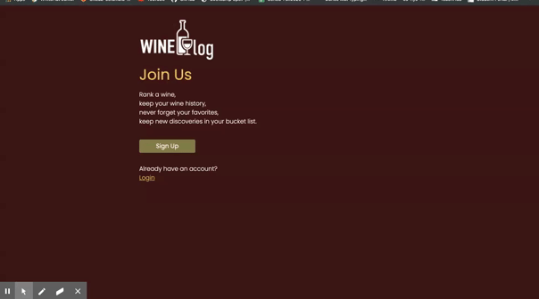

# Wine-Log

## Description

A wine logger with MySQL, Node, Express, Handlebars, Sequellize and passport.js. Also using d3 and chart.js for data visualization

## Table of Contents

- [Description](#description)
- [Installation](#installation)
- [Usage](#usage)
- [License](#license)
- [Contributing](#contributing)
- [Tests](#tests)
- [Questions](#questions)

## Installation

### Use deployed page

https://project2-women-power.herokuapp.com/

### Use Locally

- This application need node.js, please refer to [offical website](https://nodejs.org/en/download/) for installation
- download this repo by running
  ```bash
  git clone https://github.com/angelinama/wine-log
  ```
- This application also need to install mysql on your computer, please refer to [mysql website](https://www.mysql.com/downloads/) for installation

- Change password in `index.js` to your root user password of your mysql DBMS.
- install required node pacakges by running
  ```bash
  npm install
  ```
- Create schema of database according to config.json file
- start the application by running
  ```
  node server
  ```
  or
  ```
  npm start
  ```

## Usage

https://project2-women-power.herokuapp.com/

Rank a wine,
keep your wine history,
never forget your favorites,
keep new discoveries in your bucket list.


## License

[](https://opensource.org/licenses/MIT)

## Contributing

This project is not open for collaboration yet

## Tests

Tested on deployed page: https://project2-women-power.herokuapp.com/

## Questions

connect with me on [my Github](https://github.com/angelinama) and if you have additional questions, please email me at: angelina890308@gmail.com

## Credits

[Angelina Ma](https://github.com/angelinama)
[Banu Akman](https://github.com/banuakman)
[Carolina Rizk](https://github.com/crizk-crizk)
